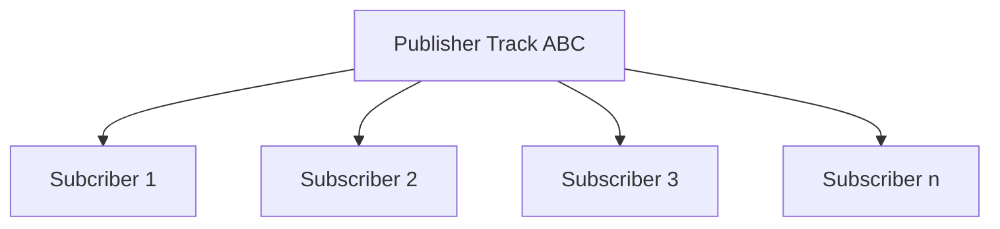
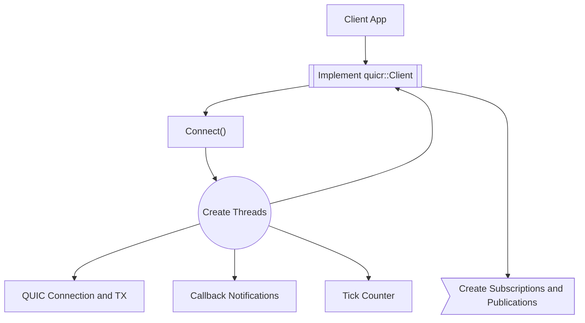
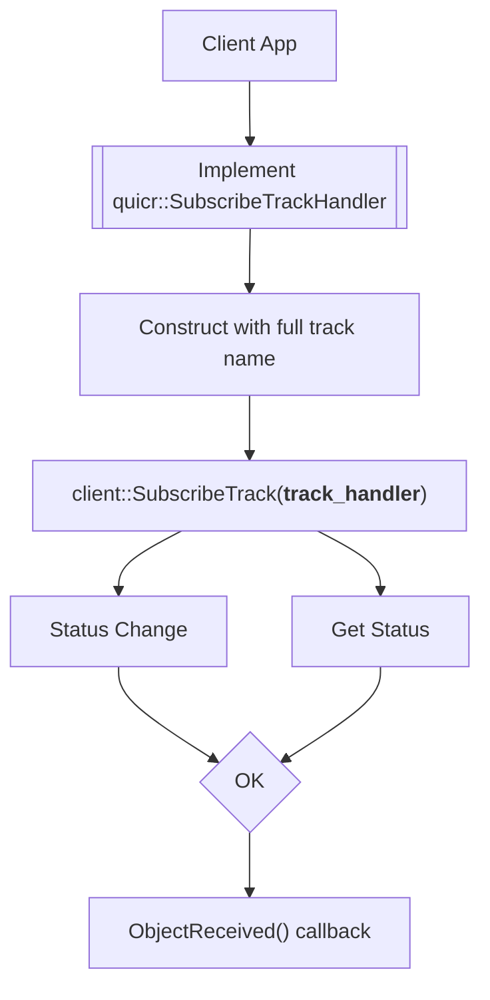
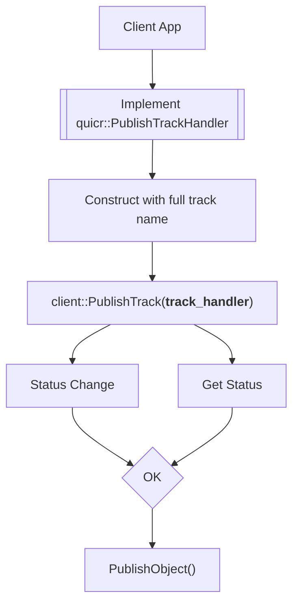

---
title:  'QuicR API Guide'
date: 2024-SEP-11
...

API Overview
============

The API aims to be a simple API wrapper to [MOQT draft-ietf-moq-transport-05](https://datatracker.ietf.org/doc/html/draft-ietf-moq-transport-05). 
The various MOQT protocol interactions with the state machine, state tracking, and underlining native QUIC transport is 
abstracted to provide a simple flexible and scalable Media Over Quic Transport (MOQT) interface for developers.

## High Level Background

MOQT is a publish/subscribe protocol that defines control flows to establish, maintain and teardown tracks. MOQT 
defines **tracks** as a flow of data from a publisher to one or more subscribers. In this sense, a track is
similar to a channel in that it is a data pipeline between publisher and N-subscribers. 

Objects are a set of bytes with a known payload size. 

## Datagram vs Stream

Objects can be of any size, but with datagram they are restricted to IPv6 minimum MTU of 1280 bytes. IP
fragmentation does allow up to 64K but that introduces IP fragmentation and challenges with that. For now, the size
(`180 IP/quic/moqt overhead size - 1280`) is 1100 bytes max payload for datagram. 

## Full Track name
Publishing objects are sent using a Full track name that subscribers subscribe to. Relay (aka server) will forward received
objects matching the full track name to one or more subscribers.

A full track name is broken into two components:

1. Track Namespace
A series of tuples to describe the namespace. Each tuple is an unbounded size of binary bytes that is opaque to the
server/relay. One of the tuples should identify the source publisher endpoint because subscribes are routed
to the matching namespace. Sharing the same namespace between many publishers will result in subscribes being
routed toward each, which will cause extra churn on the source publisher endpoint.

2. Track Name
Unbounded size of binary bytes. Name portion is intended to be used as a selector of content from a given namespace
(aka source publisher endpoint). Example would be to subscribe to publisher/endpoint (aka namespace) where name
requests low quality video and audio. 

### Track Alias
Track alias is a generated hash value of `namespace` and `name` in this implementation. It's a consistent hash that
is globally unique.  The track alias is a `uint64_t` value (*62 bits max due to QUIC variable length integer*)
that represents the full track name. Track alias is used when encoding object and other MOQT messages instead of
having to duplicate the large binary array of bytes for namespace and name. The application can choose to
specify the track alias if it wishes to override the default hash.

## High Level Flow

At a high level, this API provides a very simplistic track (aka channel, aka virtual connection) between publisher
and any given number of subscribers. The below topology represents the high level forwarding-plane that the
API provides.

## API

The API aims to provide a simple method for applications to establish subscriptions and publications using
tracks.

### Thread Safety
All API methods are thead safe.

### Client
Client has minimal components and involvement in MoQT. Client API primarily focus on establish and maintaining a QUIC
connection to a server/relay and to establish and maintain subscriptions and publications. 

#### Creating Client

The application implements [moq::Client](classquicr_1_1_client.html) with implemented overrides on
callbacks. 

After construct of the client, the application calls `Connect()` to start the connection process. The connect method will
create and run a thread for the QUIC connection. Additional two threads are created, one for a tick counter and another
for callback notifications. The three threads do the following:

1. First thread runs the QUIC event loop which maintains the QUIC connection and handles data transmission
2. Second thread executes callback notifications on received data and any change notifications
3. Third thread only performs tick counter functions

Upon `Connect()` the method will return with the status of connecting. The application is expected to either implement
the `StatusChanged()` callback or poll using `GetStatus()` to determine when/if the connection **Ready** for use.
The **ready** status indicates that the connection is established and tracks can now be subscribed and/or published. 

#### Subscriptions

The application subscribes to a track by implementing [SubscribeTrackHandler](classquicr_1_1_subscribe_track_handler.html)
first. The application should implement `ObjectReceived()` method in order to receive data from the subscribed track.
The track status will indicate **Ok** if the track is successfully subscribed. When successfully subscribed, the
`ObjectReceived()` callback will be called on every object received. 

Track handlers will be updated by the client to set various states. **The track handler can be used by only one client
at a time.** If the client needs to be reconstructed, the track handler can be reused. This will allow for the track
to resume from where the handler left off upon reconnect or redirect to another relay.

The client uses shared pointers to ensure thread safety.

#### Publications

The application publishes to a track by implementing [PublishTrackHandler](classquicr_1_1_publish_track_handler.html)
first. The application optionally implements callbacks. The track status will indicate **Ok** if the track is 
successfully able to publish. When successfully able to publish, the application uses method `PublishObject()` to send
data objects. 

Track handlers will be updated by the client to set various states. **The track handler can be used by only one client
at a time.** If the client needs to be reconstructed, the track handler can be reused. This will allow for the track
to resume from where the handler left off upon reconnect or redirect to another relay.

The client uses shared pointers to ensure thread safety.

#### Client Disconnect
The client can simply destroy the constructed client class instance or it can call `Disconnect()`. 

### Server

*TODO*

