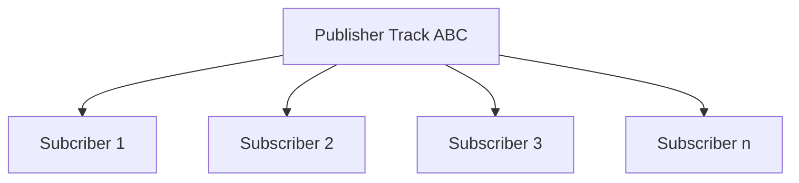
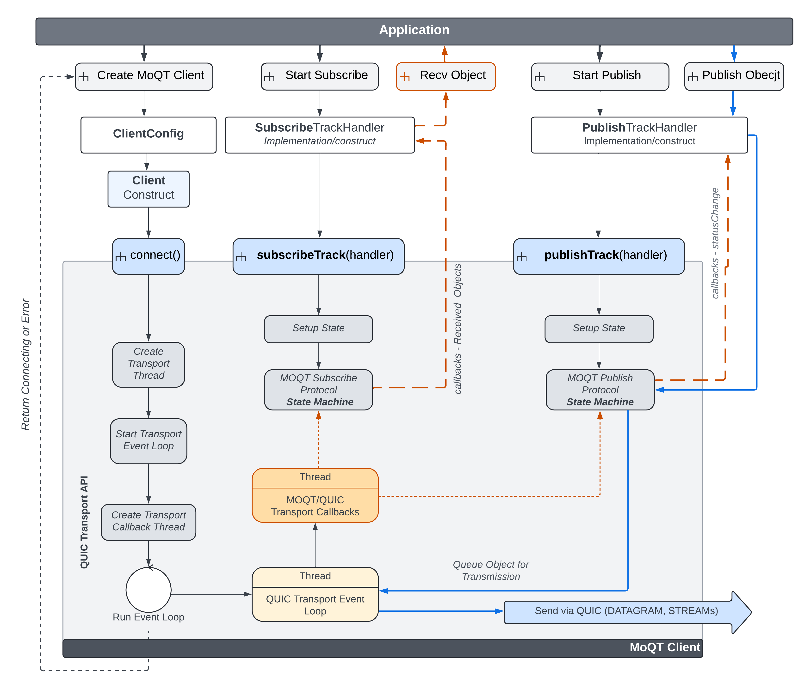

MOQT Process Flows
==================

The API aims to be a simple API wrapper to [MOQT draft-ietf-moq-transport-05](https://datatracker.ietf.org/doc/html/draft-ietf-moq-transport-05). 
The various MOQT protocol interactions with the state machine, state tracking, and underlining native QUIC transport is 
abstracted to provide a simple flexible and scalable Media Over Quic Transport (MOQT) interface for developers.
Supported implementation uses [MOQT draft-ietf-moq-transport-04](https://datatracker.ietf.org/doc/html/draft-ietf-moq-transport-04)

## High Level Background

MOQT is a publish/subscribe protocol that defines control flows to establish, maintain and teardown tracks. MOQT 
defines **tracks** as a flow of data from a publisher to one or more subscribers. Track is synonymous with channel and
data flow.  

Objects are a set of bytes with a known payload size. 

Pipelining is on the roadmap. 

## Datagram vs Stream

Objects can be of any size, but when using datagram they are restricted to IPv6 minimum MTU of 1280 bytes. IP
fragmentation does allow up to 64K, but that is on the roadmap for the future of this API. For now, the size
(`180 IP/quic/moqt overhead size - 1280`) is 1100 bytes max payload for datagram. 

## Track Fullname
Publishing objects are sent using a track fullname that subscribers subscribe to. Relay (aka server) will forward received
objects matching the track fullname to one or more subscribers. 

There can be a bit of confusion when discussing track name as the component name is also identified as name. For this reason,
when referring to a track name that publishers and subscribers use, the name **track fullname** is used.

A track fullname is broken into two components:

### (1) Track Namespace
Unbounded size of binary bytes that the application defines. The namespace normally identifies the source client
endpoint entity. It needs to identify the source endpoint because MOQT defines that all subscribes to track fullnames are
sent to the namespace, regardless of the name portion. 

### (2) Track Name
Unbounded size of binary bytes that the application defines. Considering that MOQT defines that all subscribes will
be routed to the publisher based only on the namespace component of the track fullname, it makes sense that the
name component be used more of a filter of content from a publisher.  For example, high bandwidth video feed vs
low bandwidth video feed. 

### Track Alias
Track alias is a generated hash value of `namespace` and `name` in this implementation. It's a consistent hash that
is globally unique.  The track alias is a `uint64_t` value (*62 bits max due to QUIC variable length integer*)
that represents the track fullname. Track alias is used when encoding object and other MOQT messages instead of
having to duplicate the large binary array of bytes for namespace and name.

## High Level Flow

At a high level, this API provides a very simplistic track (aka channel, aka virtual connection) between publisher
and any given number of subscribers. The below topology represents the high level forwarding-plane that the
API provides.

## API

### Client

