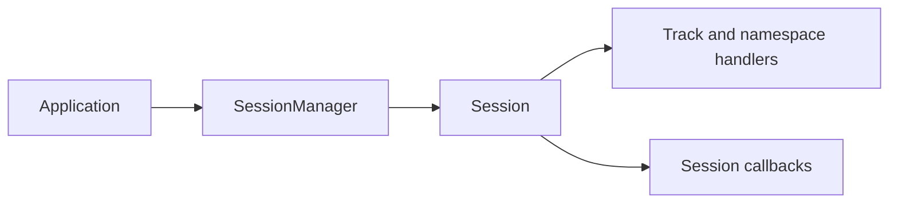

# API overview

libquicr is a C++ API for Media over QUIC Transport (MOQT). The current wire
implementation uses the `moqt-18` ALPN and draft-18 message encodings. This does
not imply that every message or optional feature from that draft is implemented.

The public API has three main layers:


```mermaid
flowchart LR
    App[Application] --> Manager[SessionManager]
    Manager --> Session[Session]
    Session --> Handlers[Track and namespace handlers]
    Session --> Callbacks[Session callbacks]
```

- `SessionManager` owns transports and active sessions.
- `Session` represents one MOQT connection in client or server mode.
- Handlers represent long-lived track, namespace, or fetch requests.
- Callback interfaces deliver connection events and answer peer requests.

There is no separate `Client` class. Applications normally create client and
server sessions through `SessionManager`.

## Names, aliases, and objects

### Full track names

A `quicr::FullTrackName` contains:

- a `quicr::TrackNamespace`, represented as an ordered tuple of binary entries;
- a binary track name.

`TrackNamespace` accepts up to 32 tuple entries through its runtime constructors.
How an application assigns meaning to the entries is deployment policy; libquicr
does not require an entry to identify a publisher.

```cpp
quicr::FullTrackName track{
    quicr::TrackNamespace(std::vector<std::string>{ "conference", "1234" }),
    std::vector<std::uint8_t>{ 'v', 'i', 'd', 'e', 'o' }
};
```

### Track aliases

Track aliases are 64-bit, session-scoped identifiers used on the wire. By
default, track operations derive an alias from
`TrackHash(full_track_name).track_fullname_hash`. A hash is not a global
identity and collisions are theoretically possible.

Publish and subscribe handlers can override the proposed alias with
`SetTrackAlias()` before registration. A subscribe handler separately records
the alias returned by its peer.

### Objects and delivery modes

`quicr::ObjectHeaders` describes an object using group, subgroup, and object
identifiers plus payload length, status, priority, TTL, delivery mode, and
extensions.

`quicr::TrackMode` selects:

- `kDatagram`: one object is carried in a QUIC DATAGRAM;
- `kStream`: objects are carried on subgroup streams.

A datagram object must fit in one negotiated QUIC DATAGRAM after MOQT and QUIC
framing. The transport currently configures a 1280-byte maximum datagram frame,
but applications must not assume a fixed 1100-byte payload limit. Use stream
mode for larger objects or when reliable delivery is required.

## Ownership and threading

`SessionManager` retains its transports and sessions. Client
`AddTransport()` returns a `std::weak_ptr<Session>`, so the manager must outlive
all use of that session.

An active `Session` retains its registered handlers with shared ownership.
Handlers keep a weak reference back to the session. Namespace publish handlers
also retain the publish-track handlers added to them. A passive
`PublishNamespaceHandler` is not retained by the session, so the application
must keep it alive.

Session and transport code synchronize their own connection state, but
`std::shared_ptr` only manages lifetime. It does not make handler state safe for
concurrent mutation. Serialize operations on the same handler, especially
publishing, subgroup completion, pause/resume, property changes, and teardown.

Session and handler callbacks run on the transport notification thread. Return
quickly: slow callbacks delay receive processing and later callbacks, and
metrics notifications may be skipped under backlog. Use `Reply::Defer()` for a
request decision that must perform slow work.

## Session callbacks and replies

Client applications derive from `quicr::Session::ClientCallbacks`. Server
applications derive from `quicr::Session::ServerCallbacks`. Both inherit the
common `Session::Callbacks` interface.

Notification callbacks return `void`, for example:

- `StatusChanged()`;
- `MetricsSampled()`;
- `OnStreamClosed()`;
- handler `ObjectReceived()` and `StatusChanged()` callbacks.

Callbacks that answer a peer request return `quicr::Reply<T, E>`. Return a value
to accept or an `Unexpected<Error<E>>` to reject:

```cpp
quicr::Reply<quicr::SubscribeResponse, quicr::RequestErrorCode>
SubscribeReceived(
  const std::shared_ptr<quicr::Session>& session,
  std::uint64_t request_id,
  const quicr::FullTrackName& track,
  const quicr::SubscribeAttributes& attributes) override
{
    if (!Authorized(track)) {
        return quicr::Unexpected<quicr::Error<quicr::RequestErrorCode>>(
          quicr::RequestErrorCode::kUnauthorized,
          "not permitted on this namespace");
    }

    return quicr::SubscribeResponse{};
}
```

`Reply<void, E>` accepts with `{}`. No later resolve call is required: the
session correlates and sends the response. Keep `request_id` when the callback
contract or a relay/fetch binding API needs it.

SETUP callbacks are synchronous and return
`Expected<void, Error<ErrorCode>>`:

```cpp
quicr::Expected<void, quicr::Error<quicr::ErrorCode>>
ServerSetupReceived(
  const std::shared_ptr<quicr::Session>& session,
  const quicr::ServerSetupAttributes& attributes) override
{
    return {};
}
```

### Deferred replies

`Reply::Defer()` moves slow work off the notification thread:

```cpp
using SubscribeReply =
  quicr::Reply<quicr::SubscribeResponse, quicr::RequestErrorCode>;

SubscribeReply SubscribeReceived(
  const std::shared_ptr<quicr::Session>&,
  std::uint64_t,
  const quicr::FullTrackName& track,
  const quicr::SubscribeAttributes&) override
{
    return SubscribeReply::Defer([this, track]() -> SubscribeReply::ResultType {
        if (!authorization_service_.Check(track)) {
            return quicr::Unexpected<quicr::Error<quicr::RequestErrorCode>>(
              quicr::RequestErrorCode::kUnauthorized,
              "authorization failed");
        }
        return quicr::SubscribeResponse{};
    });
}
```

Each deferred reply starts a detached thread and resolves once. Capture owned
state, not temporary references. An exception escaping the action is swallowed
and leaves the request unanswered until the peer times it out.

## Creating a client session

Create a `ClientConfig`, callback object, and `SessionManager`, then call
`AddTransport()`:

```cpp
class ClientEvents : public quicr::Session::ClientCallbacks
{
  public:
    void StatusChanged(
      const std::shared_ptr<quicr::Session>& session,
      quicr::Session::Status status) override
    {
        if (status == quicr::Session::Status::kReady) {
            // Track and namespace operations may now be started.
        }
    }
};

quicr::ClientConfig config;
config.endpoint_id = "camera-1";
config.connect_uri = "moqt://relay.example:33435";

auto callbacks = std::make_shared<ClientEvents>();
quicr::SessionManager manager;
auto session = manager.AddTransport(config, callbacks).lock();
if (!session) {
    throw std::runtime_error("client session was not created");
}
```

`moq://` and `moqt://` URIs select native QUIC. An `https://` URI selects
WebTransport. Transport connection creation can complete before the MOQT SETUP
exchange; wait for `Session::Status::kReady` through `StatusChanged()` or
`GetStatus()` before starting requests.

## Subscribing to a track

Derive from `SubscribeTrackHandler` when custom callbacks are needed, or use its
factory and a suitable implementation:

```cpp
class Subscriber : public quicr::SubscribeTrackHandler
{
  public:
    Subscriber(const quicr::FullTrackName& track, std::uint8_t priority)
      : SubscribeTrackHandler(
          track,
          priority,
          quicr::messages::GroupOrder::kAscending)
    {
    }

    void ObjectReceived(
      const quicr::ObjectHeaders& headers,
      quicr::BytesSpan payload,
      std::optional<quicr::messages::StreamHeaderProperties>) override
    {
        Consume(headers, payload);
    }

    void StatusChanged(Status status) override
    {
        // kOk means the subscription is active.
    }
};

auto handler = std::make_shared<Subscriber>(track, 128);
session->SubscribeTrack(handler);
```

The `BytesSpan` passed to object callbacks is valid only until the callback
returns. Copy the payload if it must be retained.

Related operations are:

- `UpdateTrackSubscription(handler)`;
- `handler->Pause()` and `handler->Resume()`;
- `handler->RequestNewGroup()`;
- `UnsubscribeTrack(handler)`.

The handler also supports filters, group order, delivery timeout, object-status
notifications, partial object delivery, subgroup completion, and per-track
metrics.

## Publishing a track

Create a `PublishTrackHandler`, register it, and wait until `CanPublish()` is
true:

```cpp
auto publisher = quicr::PublishTrackHandler::Create(
  track,
  quicr::TrackMode::kStream,
  128,   // default priority
  3000,  // default TTL in milliseconds
  { 0, 0 });

session->PublishTrack(publisher);

if (publisher->CanPublish()) {
    quicr::ObjectHeaders headers{
      .group_id = 7,
      .object_id = 12,
      .subgroup_id = 0,
      .payload_length = payload.size(),
    };

    const auto result = publisher->PublishObject(headers, payload);
    // Handle result; kOk indicates that the object was accepted.
}
```

Do not test only for status `kOk`: `kNewGroupRequested` and
`kSubscriptionUpdated` are also publishable states, which is why
`CanPublish()` is the preferred check.

For stream delivery, call
`EndSubgroup(group_id, subgroup_id, completed)` when a subgroup is complete.
Otherwise its QUIC stream remains open until the handler is unbound.

Use `UnpublishTrack(handler)` to end the publication.

## Fetch

A standalone fetch requests an inclusive object range:

```cpp
auto fetch = quicr::FetchTrackHandler::Create(
  track,
  128,
  quicr::messages::Location{ 10, 0 },
  quicr::messages::FetchEndLocation{ 20, std::nullopt });

session->FetchTrack(fetch);
```

Received fetch objects use the subscribe handler callbacks inherited by
`FetchTrackHandler`. Use `CancelFetchTrack(fetch)` to cancel local fetch state.

A joining fetch is configured on a custom `SubscribeTrackHandler` and combines a
historical fetch range with the live subscription.

Applications serving fetches answer `StandaloneFetchReceived()` or
`JoiningFetchReceived()`, create a `PublishFetchHandler` using the incoming
request ID, and bind it with `BindFetchTrack()`. After publishing the requested
range, call `UnbindFetchTrack()` to drain and finish the fetch stream.

`FetchCancelReceived()` exists in the callback interface, but FETCH_CANCEL send
and receive handling is not currently wired. `CancelFetchTrack()` only removes
local fetch state.

## Namespace operations

Namespace publication and track publication are separate operations.

- `PublishNamespace(handler)` sends `PUBLISH_NAMESPACE`.
- `PublishNamespace(handler, true)` registers a passive local namespace without
  sending or retaining a request. The application owns that passive handler.
- `PublishNamespaceDone(handler)` ends a non-passive namespace request. It does
  not apply to a passive handler because that handler has no request stream.

`PublishNamespaceHandler` can contain publish-track handlers and route
`PublishObject()` by track alias.

Namespace subscriptions use `SubscribeNamespaceHandler`:

```cpp
auto namespaces = quicr::SubscribeNamespaceHandler::Create(
  prefix,
  quicr::SubscribeNamespaceHandler::Mode::kNamespaces);
session->SubscribeNamespace(namespaces);
```

- `kNamespaces` receives matching namespace suffixes through
  `NamespaceReceived()`.
- `kTracks` requests matching track publications; the resulting PUBLISH
  requests are delivered through session callbacks.

Use `UnsubscribeNamespace(handler)` to end either mode.

## Track status

`RequestTrackStatus(full_track_name, attributes)` sends a status request on the
session control stream and returns its request ID. The receiving peer answers
through `TrackStatusReceived()`, returning a `TrackStatusResponse` or a request
error.

The current sender ignores the supplied `SubscribeAttributes`, and received
TRACK_STATUS responses are not exposed back to the requesting application.

`SessionManager::AddHandler(session, handler)` and `RemoveHandler()` are
type-dispatching conveniences for the corresponding publish, subscribe,
namespace, and fetch session methods. Release passive publish namespace
handlers directly rather than passing them to `RemoveHandler()`.

## Creating a server

Server mode uses `ServerConfig`, `Session::ServerCallbacks`, and optional
`SessionManager::Callbacks`:

```cpp
class ManagerEvents : public quicr::SessionManager::Callbacks
{
  public:
    void OnNewServerSession(
      const std::shared_ptr<quicr::Session>& session) override
    {
        // Retain application state associated with this connection.
    }
};

quicr::ServerConfig config;
config.endpoint_id = "relay-1";
config.server_bind_ip = "::";
config.server_port = 33435;
config.transport_config.tls_cert_filename = certificate_path;
config.transport_config.tls_key_filename = private_key_path;

auto manager_callbacks = std::make_shared<ManagerEvents>();
auto session_callbacks = std::make_shared<ServerEvents>();
quicr::SessionManager manager(manager_callbacks);
manager.AddTransport(config, session_callbacks);
```

Certificate and key material remain external files; do not embed either in
source code. Validate deployed certificates for validity dates, key strength,
signature algorithm, hostname/SAN, and intended trust model.

`ServerCallbacks` answers incoming SETUP, SUBSCRIBE, PUBLISH, NAMESPACE, FETCH,
and teardown requests. A server-mode session supplies protocol mechanics for one
connection; cross-session relay routing remains application policy.

For relay use:

- accept a subscriber's `SubscribeReceived()` request;
- create a `PublishTrackHandler` for that subscriber;
- call `BindPublisherTrack(source_id, request_id, handler)`;
- receive publisher objects through a `SubscribeTrackHandler`;
- publish or forward those objects to the bound subscriber handlers.

`ForwardingSubscribeTrackHandler` can forward subgroup stream bytes without
decoding every object. Datagram objects still use normal object callbacks.

## Metrics and errors

Connection metrics arrive through `Session::Callbacks::MetricsSampled()`.
Publish and subscribe metrics arrive through their handlers. Period metrics
reset after each sample, so retain values needed for longer-term aggregation.

Errors are reported through:

- session and handler status enums;
- `PublishObjectStatus`;
- request `Reply` error types;
- `TransportError` and `TransportException`;
- namespace handler `GetError()`.

Prefer status callbacks for transitions and getters for snapshots.

## Shutdown

Call `session->Disconnect()` to close one connection. Dropping an application
reference alone does not disconnect it because `SessionManager` retains active
sessions. Destroying the manager shuts down all transports it owns.

Unsubscribe, unpublish, cancel fetches, and complete subgroups before shutdown
when protocol-level teardown matters to the peer.

For a complete working example, see `examples/qclient/client.cpp`.
