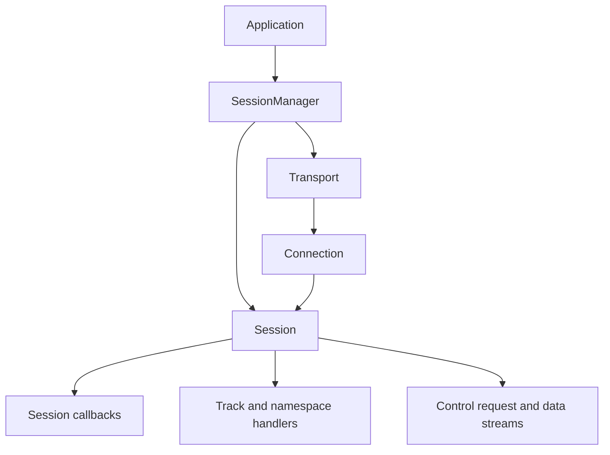
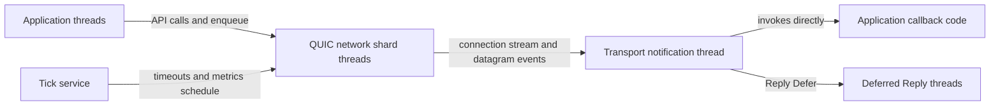
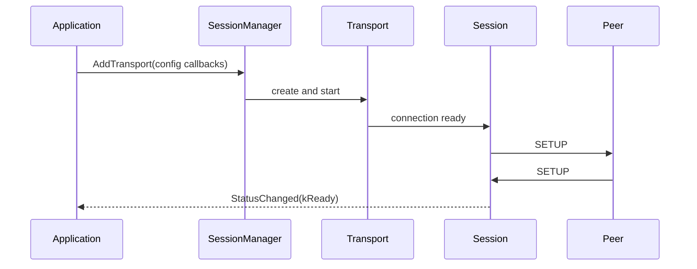
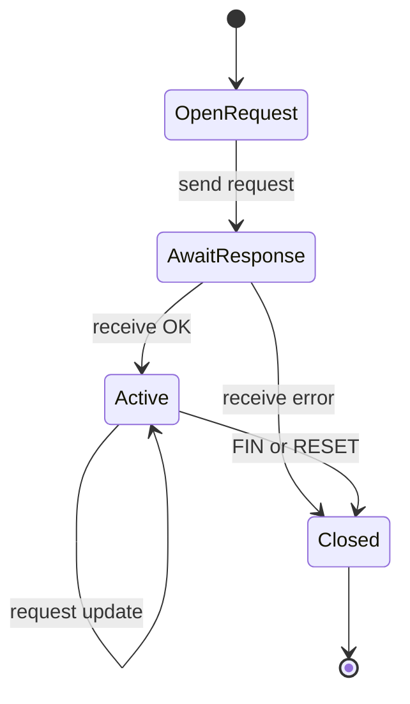
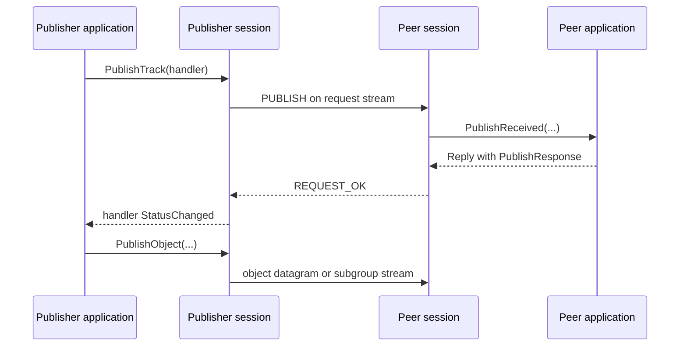
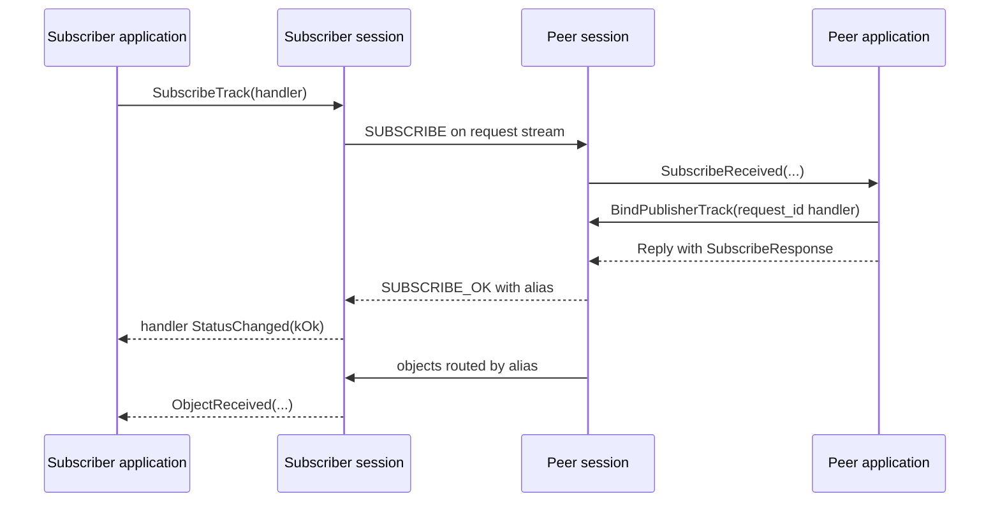
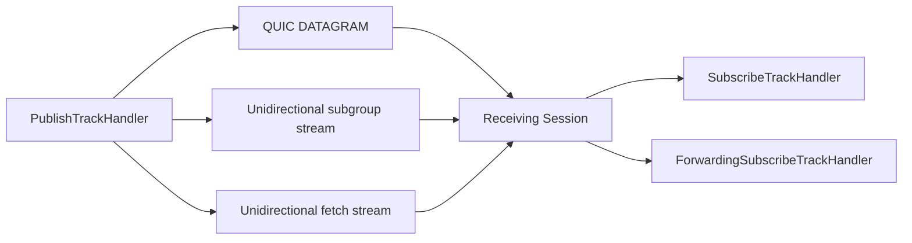
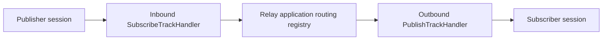

# MOQT implementation

This document describes the current libquicr architecture and protocol flow.
The runtime advertises the `moqt-18` ALPN for native QUIC and uses draft-18
message encodings. Some optional messages and filters remain incomplete, so this
is an implementation target rather than a claim of full draft conformance.

Application-facing usage is covered in [the API guide](api-guide.md).

## Terminology

- **Track namespace**: an ordered tuple of binary entries.
- **Full Track Name**: a track namespace plus a binary track name.
- **Request ID**: a session-scoped identifier for a track, namespace, status, or
  fetch request. The low bit identifies the initiating endpoint role.
- **Track alias**: a session-scoped 64-bit identifier used to route object data.
- **Object**: application payload and metadata identified by group, subgroup,
  and object IDs.
- **Control stream**: the long-lived stream carrying session-level control
  messages such as SETUP.
- **Request stream**: a dedicated bidirectional stream carrying one request,
  its response, later updates, and teardown.
- **Data stream**: a unidirectional subgroup or fetch stream carrying objects.

Track aliases default to a hash of the Full Track Name. They are not guaranteed
globally unique and must not be used as durable identities outside their
session.

## Architecture

### SessionManager

`SessionManager` is the top-level lifetime owner:

- it creates and starts client or server transports;
- it retains active transports and sessions;
- it creates one client session for an outbound connection;
- it creates one server session for each accepted connection;
- it exposes accepted/removed sessions through `SessionManager::Callbacks`;
- its destructor shuts down all managed transports.

Client `AddTransport()` returns a weak session reference because the manager
retains the strong reference.

### Transport and Connection

`Transport` abstracts PicoQUIC and supports:

- native MOQT over QUIC, selected by `moq://` or `moqt://`;
- WebTransport, selected by `https://`;
- bidirectional and unidirectional streams;
- QUIC DATAGRAM;
- queued writes, stream closure/reset, metrics, and connection lifecycle.

A server transport can accept native MOQT and WebTransport connections. Each
accepted `Connection` has one `Session` delegate. PicoQUIC operations are
marshalled to the network shard that owns the connection.

TLS certificate and private-key values in `TransportConfig` are filenames, not
embedded credential material. Deployments must validate certificate expiration,
validity start, hostname/SAN, key strength, signature algorithm, and whether
self-signing is intentional.

### Session

`Session` is a unified client/server MOQT endpoint for one connection. It owns:

- SETUP and connection status;
- the transmit control stream and received control-stream identity;
- request-ID allocation;
- request stream and handler maps;
- proposed and received track-alias maps;
- publish, subscribe, namespace, and fetch request state;
- protocol parsing, serialization, and connection metrics.

The mode is fixed when the session is constructed. Applications normally obtain
sessions through `SessionManager`, although lower-level `Session::Create()`
factories exist.

### Callbacks and handlers

`Session::ClientCallbacks` and `Session::ServerCallbacks` provide connection and
peer-request callbacks. Both inherit common callbacks from
`Session::Callbacks`.

Track and namespace handlers represent active requests:

- `SubscribeTrackHandler`;
- `PublishTrackHandler`;
- `FetchTrackHandler`;
- `PublishFetchHandler`;
- `SubscribeNamespaceHandler`;
- `PublishNamespaceHandler`;
- `ForwardingSubscribeTrackHandler`.

The session retains active handlers with shared ownership. `TrackHandler` keeps
a weak reference to the session, avoiding a reference cycle. A publish namespace
handler additionally owns the publish-track handlers registered beneath it.
Passive publish namespace handlers are the exception: the session initializes
but does not retain them, so the application owns their lifetime.

## Threading model

Thread count is configuration-dependent rather than fixed at three.

- A transport has one PicoQUIC network thread per configured shard.
- A transport notification thread serializes connection, stream, datagram, and
  metrics notifications.
- The default threaded tick service adds a thread, but a shared or custom tick
  service can be injected.
- Application threads call session and handler APIs. Transport writes are
  queued to the owning network shard.
- Each `Reply::Defer()` action runs on its own detached thread.

Session internals protect shared maps and selected statuses are atomic, but this
is not a blanket thread-safety guarantee for handler state. Calls that mutate a
single handler should be serialized. Callback implementations must return
promptly because they run on the notification thread. Under callback backlog,
metrics notifications can be skipped.

## Session lifecycle

1. `SessionManager` creates and starts a transport.
2. A connection is associated with a new `Session`.
3. When QUIC is ready, the session opens its control stream and sends SETUP.
4. The peer's SETUP is validated by `ServerSetupReceived()` or
   `ClientSetupReceived()`.
5. The session reaches `kReady` only after local SETUP has been sent and peer
   SETUP has been accepted.
6. `Disconnect()` detaches the session delegate and asks the transport to close
   the connection. Applications should perform request teardown first when
   handler status transitions or peer-visible completion matter.

Transport connection creation and MOQT readiness are distinct. A client can
receive a session from `AddTransport()` while SETUP is still pending.

## Control and request streams

Session-level messages use the control stream. Track, namespace, and fetch
operations use dedicated bidirectional request streams. `RequestTrackStatus()`
is an exception: it sends TRACK_STATUS on the control stream.

The session allocates request IDs with client/server parity, opens a request
stream, and maps the stream to the request and handler. Stream FIN or RESET is a
protocol lifecycle event: it closes the request and removes associated state.

Request callbacks return `Reply` objects. The session converts the reply to the
appropriate OK or ERROR message on the same request stream. There is no separate
public resolve step.

## Publishing a track

`Session::PublishTrack()` implements publisher-initiated PUBLISH. It is
independent of namespace publication.

The PUBLISH request carries the Full Track Name, proposed alias, parameters, and
track extensions. Acceptance returns a `PublishResponse` and a
`SubscribeTrackHandler` that receives the publisher's objects.

The local publish handler starts in a pending state. `CanPublish()` becomes true
for `kOk`, `kNewGroupRequested`, and `kSubscriptionUpdated`.

For stream mode, each group/subgroup has an owned stream. The application calls
`EndSubgroup()` when the subgroup is complete. Unbinding ends any subgroup
streams that remain open.

`UnpublishTrack()` removes local publication state and can send PUBLISH_DONE,
but it does not currently close the request stream. Server/relay code uses
`UnbindPublisherTrack()` for handlers created from an incoming subscription.

## Subscribing to a track

`SubscribeTrack()` allocates a request ID and request stream, sends priority,
group order, filter, delivery timeout, and optional joining-fetch parameters,
and waits for SUBSCRIBE_OK. The returned track alias is installed in the
subscribe handler and used to route incoming data.

The original request stream remains active for updates. Pause, resume, and
new-group operations send request updates. `UnsubscribeTrack()` cancels the
request stream and removes alias and handler state; peer cleanup is driven by
request-stream closure.

## Object data plane

Datagrams are parsed and routed by track alias. They must fit in one negotiated
QUIC DATAGRAM after all framing.

Subgroup streams carry a stream header and a sequence of object records. Normal
subscribe handlers receive parsed objects. A `ForwardingSubscribeTrackHandler`
instead receives the subgroup header and raw stream chunks so a relay can
forward bytes without decoding each object. Datagrams still follow parsed
object callbacks.

Fetch objects use a dedicated fetch data stream and are routed by request ID.

## Namespace discovery

Namespace publication and track publication are separate.

`PublishNamespace(handler)` sends PUBLISH_NAMESPACE and tracks the request
stream. Passive mode marks the handler ready without sending a request or
retaining it in the session; the application must retain a passive handler.
`PublishNamespaceDone()` cancels a non-passive namespace request. It cannot end
a passive handler because that handler has no request stream.

`SubscribeNamespaceHandler` has two modes:

- `kNamespaces` sends SUBSCRIBE_NAMESPACE and receives matching namespace
  suffix notifications through `NamespaceReceived()`;
- `kTracks` sends SUBSCRIBE_TRACKS and receives matching PUBLISH activity
  through session callbacks.

Prefix matching and suffix expansion use the tuple entries in
`TrackNamespace`, not a slash-delimited text path.

## Fetch

Standalone fetch:

1. `FetchTrack()` sends FETCH with inclusive start and end locations.
2. The peer invokes `StandaloneFetchReceived()`.
3. The serving application creates `PublishFetchHandler` with the incoming
   request ID and calls `BindFetchTrack()`.
4. Fetch objects are published on a fetch data stream.
5. The serving application calls `UnbindFetchTrack()` to drain queued objects,
   finish the fetch stream, and remove its publisher binding.

A joining fetch is attached to a subscription and combines a historical range
with live delivery. The peer answers `JoiningFetchReceived()`. Internally, a
joining-fetch adapter forwards fetched objects into the subscription handler.

Local `CancelFetchTrack()` removes fetch state. QUIC-level cancellation still
has incomplete behavior in the current implementation.

## Relay integration

libquicr provides endpoint protocol mechanics, not a global relay routing
policy. A relay application owns the registry that links handlers across
different sessions.

A typical subscriber-initiated relay flow is:

1. A subscriber session invokes `SubscribeReceived()`.
2. The relay authorizes the request and locates the publishing session.
3. The relay creates an outbound `PublishTrackHandler`.
4. It calls `BindPublisherTrack(source_id, request_id, handler)` on the
   subscriber session.
5. It records the relationship between the publisher's inbound subscribe
   handler and the subscriber's outbound publish handler.
6. Received objects or raw subgroup bytes are forwarded to every bound
   subscriber.
7. Request-stream closure removes the binding.

For publisher-initiated operation, `PublishReceived()` returns a
`PublishResponse` containing the inbound `SubscribeTrackHandler`. Namespace
subscriptions can help an application discover publishers and tracks, but they
do not replace the relay's application-owned routing registry.

## Metrics and backpressure

The transport samples connection and stream metrics at
`TransportConfig::metrics_sample_ms`.

- Connection metrics are delivered first through
  `Session::Callbacks::MetricsSampled()`.
- Publish and subscribe metrics follow through their handlers.
- Period counters reset after the sample.
- Queue depth and drop/latency fields expose transport backpressure.

Notification processing is serialized. Slow callbacks increase queue latency;
some metrics notifications can be skipped when the callback queue is backed up.

## Teardown

Request-stream FIN and RESET are the common teardown mechanism.

- `UnsubscribeTrack()` cancels the subscription request.
- `UnpublishTrack()` removes local publication state and may send PUBLISH_DONE;
  it does not currently close its request stream.
- `UnbindPublisherTrack()` removes a server/relay publication binding.
- `PublishNamespaceDone()` closes non-passive namespace publication state.
- `UnsubscribeNamespace()` cancels namespace or track-prefix subscription.
- `CancelFetchTrack()` removes local fetch state.
- `UnbindFetchTrack()` drains and completes a serving fetch.
- `Disconnect()` detaches the session and closes the connection; it does not
  itself run normal session cleanup callbacks.
- Destroying `SessionManager` shuts down its transports.

Application code should explicitly end subgroups and requests when peer-visible
teardown matters.

## Known limitations

The current source contains incomplete or provisional behavior in these areas:

- SETUP exposes no meaningful negotiated MOQT version; setup attributes
  currently report zero.
- Default track aliases are hashes with no documented collision-resolution
  policy.
- There is no stable API-level maximum datagram payload after all framing.
- Some declared message types and complex filters are not fully processed.
- FETCH_CANCEL send and receive handling is not currently wired;
  `CancelFetchTrack()` only removes local state.
- TRACK_STATUS request attributes are ignored, and responses are not surfaced
  to the requesting application.
- PUBLISH_NAMESPACE rejection handling contains an unfinished error path.
- Some PUBLISH_DONE and request-error teardown cases remain TODOs.
- Publish handler status names retain some legacy announce terminology.

Use integration tests under `test/integration_test/` as executable examples of
the currently supported request, namespace, fetch, forwarding, and teardown
flows.
