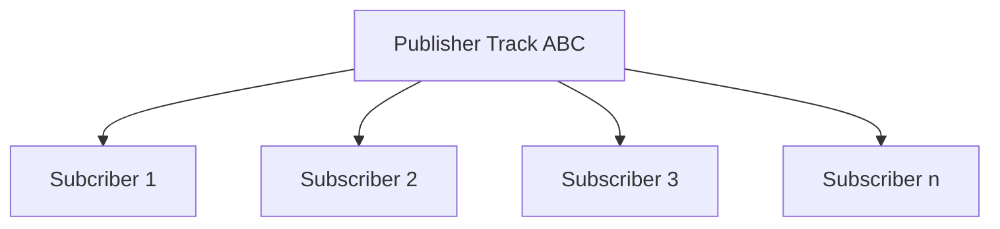
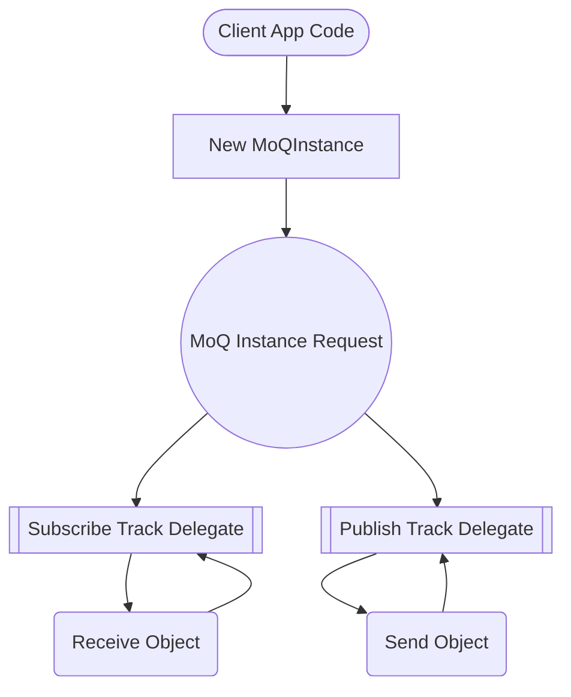
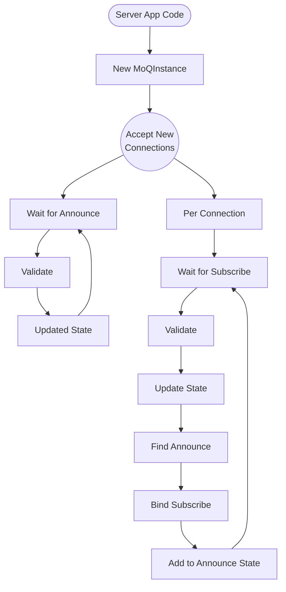
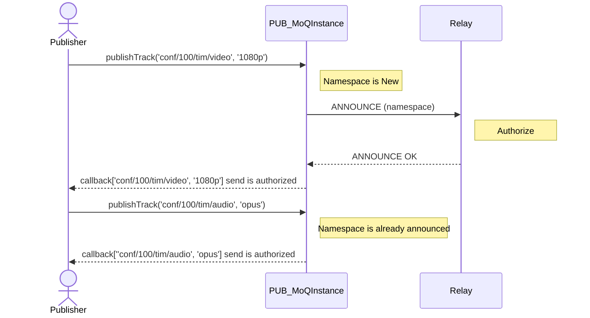
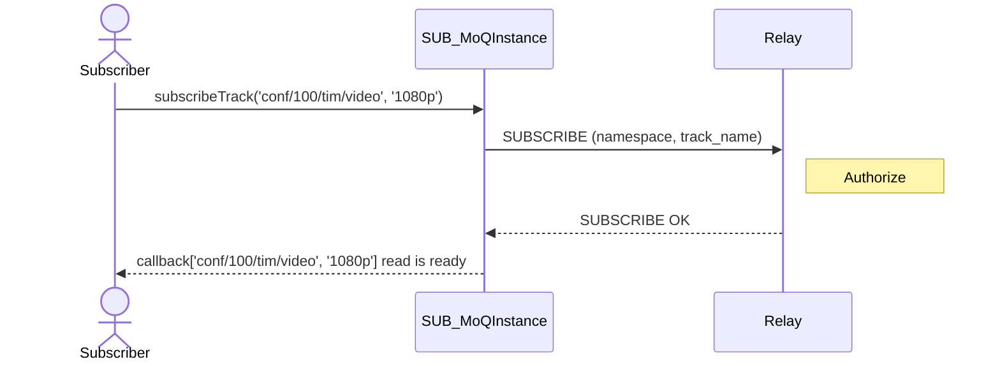
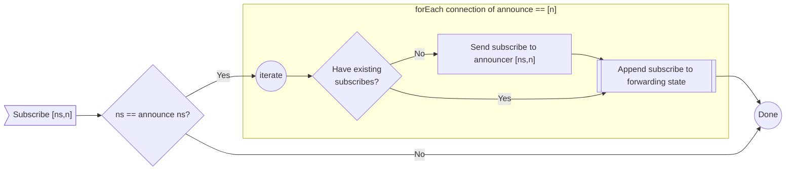
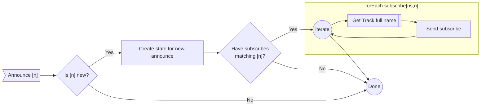

MOQT Implementation
===================

Supported implementation uses [MOQT draft-ietf-moq-transport-04](https://datatracker.ietf.org/doc/html/draft-ietf-moq-transport-04)

MOQT is a publish/subscribe protocol that defines control flows to establish, maintain and teardown tracks. MOQT 
defines **tracks** as a flow of data from a publisher to one or more subscribers. Track is synonymous with channel and
data flow.  

Objects are a set of data that as a whole is published and received by subscribes as a complete object. For example,
sending data array of 2500 bytes (aka object) is published to a track and delivered to all subscribers as a complete
object. The subscriber will receive the complete 2500 bytes as an object. 

## Datagram vs Stream

Objects can be of any size, but when using datagram they are restricted to MTU size in MOQT. **Libquicr** implements
value added feature to optionally **slice** objects into smaller slices to be transmitted via datagram and stream objects. 
For datagram, object sizes greater than transport 1280 will automatically but sliced at the current MTU size. Subscribers
will reassemble the slices to generate the complete object that was published. In this sense, the application on
both sides are unaware that the object needed to be slice in order to efficiently transmit it. 

## Track Fullname
Publishing objects are sent using a track fullname that subscribers subscribe to. Relay (aka server) will forward received
objects matching the track fullname to one or more subscribers. 

There can be a bit of confusion when discussing track name as the component name is also identified as name. For this reason,
when referring to a track name that publishers and subscribers use, the name **track fullname** is used.

A track fullname is broken into two components:

### (1) Track Namespace
Unbounded size of binary bytes that the application defines. The namespace normally identifies the source client
endpoint entity. It needs to identify the source endpoint because MOQT defines that all subscribes to track fullnames are
sent to the namespace, regardless of the name portion. 

### (2) Track Name
Unbounded size of binary bytes that the application defines. Considering that MOQT defines that all subscribes will
be routed to the publisher based only on the namespace component of the track fullname, it makes sense that the
name component be used more of a filter of content from a publisher.  For example, high bandwidth video feed vs
low bandwidth video feed. 

### Track Alias
Track alias is a generated hash value of `namespace` and `name` in this implementation. It's a consistent hash that
is globally unique.  The track alias is a `uint64_t` value (*62 bits max due to QUIC variable length integer*)
that represents the track fullname. Track alias is used when encoding object and other MOQT messages instead of
having to duplicate the large binary array of bytes for namespace and name.

## API

### High Level Flow

At a high level, this API provides a very simplistic track (aka channel, aka virtual connection) between publisher
and any given number of subscribers. The below topology represents the high level forwarding-plane that the
API provides. 

#### As Client 

As a client, the flow is quite simple. Below illustrates a Client using the API. 

#### As Server/Relay

As a server/Relay; Below illustrates at a high level the server API.

> [!NOTE]
> The below does not include the decision tree and flow interaction for sending subscribe to
> announcer.  That's an extra flow that is shown later. 

### MOQ Track Delegate
Publish and subscribe use the same delegate interface and base implementation. The track delegate can be subscribe only,
publish only, or both publish and subscribe. The caller creates the delegate and ownes the lifecycle of it. 
The `MoQInstance` holds a reference to the delegate so that callbacks can be used concurrently/thread-safe. 

The track delegate is the primary handler for sending and receiving data to/from a track. Callbacks are implemented
in the delegate to notify the caller of various events. 

### MOQ Instance Delegate

The caller implements and ownes the `MoQInstance` delegate. The instance delegate is passed to the `MoQInstance` 
constructor. The `MoQInstance` creates a thread-safe reference to the delegate. Callbacks are implemented by 
the caller to be notified on various MOQT control flow events. Various control flow events include status of the
instance, connection status, new connections, announces, subscribes, etc.

### MOQ Instance

The `MoQInstance` is a QUIC connection instance, which is either a client or server. In client mode, it represents
a single QUIC connection to a server. In serer mode, it represents a listening socket that accepts many QUIC connections.

## Control Message Flows

### Create Publish Track Flow

API call to `publishTrack(connection_id, track_delegate)` will establish a new publish track fullname. If the track
**namespace** is new and has not been processed before, a **MOQT announce** flow will be implemented. Below shows
the flow. 

In the above diagram, it shows the flow of creating new publishing tracks. In this state it will not be able to
send any objecs yet. 

>[!NOTE]
> Notice that the result is only
> that **"send is authorized"**. If the caller published objects in this state, the objects would be dropped
> because per MOQT design, send cannot send anything till it has a matching track fullname subscribe. The reason
> we cannot send is due to a restriction in MOQT that requires a **subscribe_id** to be encoded on sent objects. The
> publisher cannot send objects till MOQT subscribe happens first, which provides a **subscribe_id** that is then used
> by the publish track to send objects. 

### Create Subscribe Track Flow

API call to `subscribeTrack(connection_id, track_delegate)` will establish a new subscribe track fullname. A MOQT
subscribe will be sent when calling this method. 

Below shows the flow of what happens with an initial subscribe. 

>[!NOTE]
> Notice in the above diagram, the subscribe is successful and data could be read, but it does not
> yet result in objects being received.  

### Subscribe and Publish Announce Flows

Before data can be sent to the subscribe, the relay **MUST** associate publish announcements by issuing a subscribe
to the publisher. The publisher will then acknowledge the track fullname and will start to send data using the
`subscribe_id` for the track fullname (track alias). 

Depending on if subscribe or announce comes first, the flow is different.

#### Subscribe handling when publisher announcement comes before subscribe

Below illustrates the flow of when subscribe arrives after announcer is already known.

> [!NOTE]
> In the multiple publisher use-case, the connection ID is taken into account when processing the above flow. Forwarding
> state is updated for each matching namespace publisher. What is not shown, but is pretty complicated, is that
> not all publishers will subscribe OK to `[ns,n]`, resulting in some being added to the forwarding state and others not.

#### Subscribe handling when publisher announcement comes after subscribe
Below illustrates the flow of when subscribe arrives before announcer.

> [!NOTE]
> Noticed that the above flow is not so complicated with having to update each announcer, but it is more complicated
> in identifying each distinct subscribe `[ns,n]`.

### Unsubscribe Flow
Unsubscribe flow gets pretty complicated as the state requires notifying the publisher (announcer) using an unsubscribe
to indicate there are no subscribers. If there is at lest one subscriber, then the announcer is not unsubscribed.
If there are zero subscribers left, then an unsubscribe is sent to each of the announcers that
matches `[ns,n] = track_alias = track fullname`

TODO: add flow diagram

### Unannounce Flow
Unannounce flow is complicated in that SUBSCRIBE_DONE should be sent first to indicate that publishing is over. 
When the relay receives a SUBSCRIBE_DONE, it updates the state of the subscription to the publisher to indicate it's over.
The relay could propagate the SUBSCRIBE_DONE, but then that would cause excessive churn over thousands of subscribers,
especially when considering that in MOQT the only way to come back from SUBSCRIBE_DONE is to unsubscribe and subscribe again...
more churn. 

For this reason, the relay does not propagate this right now. 

For the same reasoning as mentioned above, the relay will process an UNANNOUNCE and remove the announcer
and associated forwarding table entries, but will not cause excessive churn with subscribers to notify them yet that
the publisher is gone. The existing subscribes will linger until the clients decide to unsubscribe. 

The MOQT draft-04 has TRACK_STATUS, which should be used to convey per subscriber and publisher on 
status if there are any subscribers and/or publishers. 

Excessive churn can be seen more often with race conditions, which would benefit from some level of dampening. 
The current example/relay implementations takes this into account. 

